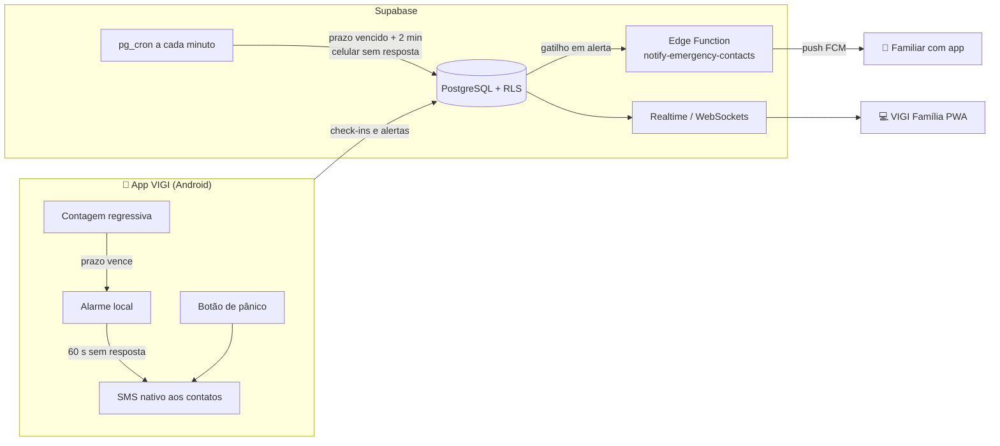

# VIGI

Aplicativo de **segurança assistiva** para idosos e pessoas que vivem sozinhas,
baseado no princípio do **dead man's switch**: o silêncio é o gatilho. O VIGI pede
confirmações periódicas de bem-estar ("Estou bem") e, se não houver resposta,
avisa automaticamente os contatos de emergência com a localização. Há também um
botão de pânico e um painel web para a família acompanhar sem invadir a
privacidade.

> Projeto de TCC. Flutter + Supabase + Firebase Cloud Messaging.

---

## Sumário

- [Visão geral](#visão-geral)
- [Como testar (sem compilar nada)](#como-testar-sem-compilar-nada)
- [Rodando a partir do código](#rodando-a-partir-do-código)
- [Configuração](#configuração)
- [Estrutura do projeto](#estrutura-do-projeto)
- [Backend (Supabase)](#backend-supabase)
- [Testes automatizados](#testes-automatizados)
- [Limitações conhecidas](#limitações-conhecidas)
- [Documentação complementar](#documentação-complementar)

---

## Visão geral

| Parte | Entrada | Tecnologia | Usuário |
|---|---|---|---|
| **App VIGI** | `lib/main.dart` | Flutter, Android nativo | Pessoa acompanhada (idoso) |
| **VIGI Família** | `lib/main_family.dart` | Flutter Web / PWA | Familiar ou cuidador |
| **Backend** | `supabase/` | PostgreSQL, RLS, Realtime, pg_cron, Edge Functions | — |



**Canais de alerta (redundantes):**

1. **SMS automático** pelo chip do idoso — funciona sem internet.
2. **Push FCM** para familiares com o app instalado.
3. **Painel VIGI Família** em tempo real, com alarme sonoro e notificação do navegador.
4. **Dead man's switch no servidor** — se o celular desligar ou ficar sem bateria,
   o próprio banco detecta o prazo vencido e dispara o alerta.

**Privacidade:** a família vê apenas se a pessoa está bem, o último sinal e o
próximo check-in. A localização só é compartilhada em emergências, e o vínculo
só existe se a pessoa acompanhada tocar em **Permitir**.

---

## Como testar (sem compilar nada)

Guia passo a passo com roteiro de testes: **[docs/TESTE.md](docs/TESTE.md)**.

Resumo:

1. Instale o **APK** do VIGI em um celular Android (peça o arquivo ao autor ou
   gere com `flutter build apk --release`).
2. Abra o **VIGI Família** no navegador (endereço publicado no Render ou
   `flutter run -d chrome -t lib/main_family.dart`).
3. Crie uma conta em cada um, vincule pelo **código VIGI** e teste o pânico e o
   check-in.

---

## Rodando a partir do código

### Pré-requisitos

- **Flutter 3.38.5** (Dart 3.10) — `flutter --version`
- **Android SDK** (Android Studio) e um celular com depuração USB ou emulador
- Chrome, para o painel web

### Passos

```bash
git clone https://github.com/geffinh0/vigi.git
cd vigi
flutter pub get

flutter run                                     # app do idoso (Android)
flutter run -d chrome -t lib/main_family.dart   # painel da família (web)
```

Gerar os pacotes finais:

```bash
flutter build apk --release                             # build/app/outputs/flutter-apk/app-release.apk
flutter build web -t lib/main_family.dart --release     # build/web
```

> O SMS automático, o alarme em segundo plano e o widget só funcionam em
> **celular Android real** (no emulador o SMS não é entregue).

---

## Configuração

**Não é necessário nenhum arquivo `.env`.** O app não lê `.env`: o endereço do
Supabase e a chave pública (*anon/publishable key*) ficam em
[`lib/app/config/app_config.dart`](lib/app/config/app_config.dart). Essa chave é
pública por natureza (vai dentro do APK) — a segurança dos dados é garantida pelo
**Row Level Security** no banco.

Valores opcionais via `--dart-define`:

| Variável | Uso | Padrão |
|---|---|---|
| `SUPABASE_URL` | Projeto Supabase | projeto do TCC |
| `SUPABASE_PUBLISHABLE_KEY` | Chave pública do projeto | chave do TCC |
| `FAMILY_WEB_URL` | Link do painel enviado no convite por WhatsApp | vazio |

Exemplo: `flutter build apk --release --dart-define=FAMILY_WEB_URL=https://vigi-familia.onrender.com`

### Firebase (push) — opcional

O arquivo `android/app/google-services.json` **não é versionado**. Sem ele o app
compila e funciona normalmente; apenas o **push para familiares fica desativado**
(SMS e painel web continuam funcionando). Para ativar o push, coloque o arquivo do
projeto Firebase nesse caminho.

---

## Estrutura do projeto

O código segue **Clean Architecture** por funcionalidade, com **BLoC** na
apresentação. Detalhes em **[docs/ARQUITETURA.md](docs/ARQUITETURA.md)**.

```
lib/
├── main.dart                 # entrada do app do idoso
├── main_family.dart          # entrada do painel web da família
├── bootstrap.dart            # inicialização (Supabase, DI, notificações, push)
├── app/                      # raiz do app, tela inicial, AppConfig
├── family_web/               # app web da família (roteador e composição)
├── injection/                # injeção de dependências (get_it)
├── core/
│   ├── services/             # alarme, notificações, SMS de emergência, push FCM, widget
│   ├── router/               # rotas (go_router)
│   ├── theme/ widgets/       # identidade visual e componentes
│   └── errors/ utils/        # Failure, logger, relógio, localização
└── features/
    ├── auth/                 # login e cadastro
    ├── checkin/              # dead man's switch (modos, prazos, alarme)
    ├── contacts/             # contatos de emergência
    ├── panic/                # botão de pânico
    └── family/               # vínculo com consentimento + painel da família
        (cada feature: data/ → domain/ → presentation/)

android/app/src/main/kotlin/…
├── MainActivity.kt           # canal nativo de SMS (SmsManager)
└── GuardiaoWidgetProvider.kt # widget da tela inicial

supabase/
├── migrations/               # esquema, RLS, cron, gatilhos, RPCs
└── functions/notify-emergency-contacts/   # push FCM HTTP v1
```

> O nome interno do pacote continua `guardiao` (e o `applicationId`
> `com.guardiao.guardiao`) porque o projeto Firebase está registrado com ele.
> O nome exibido ao usuário é **VIGI**.

---

## Backend (Supabase)

Projeto já configurado. Para recriar em outro projeto:

```bash
supabase link --project-ref <SEU_PROJECT_REF>
supabase db push                                               # aplica as migrations
supabase functions deploy notify-emergency-contacts --use-api  # publica a Edge Function
supabase secrets set FIREBASE_SERVICE_ACCOUNT="$(base64 -w0 conta-de-servico.json)"
```

| Migration | O que faz |
|---|---|
| `20260815000000_init_schema` | Tabelas, RLS e gatilho de criação de perfil |
| `20260816000000_add_monitoring_modes` | Modos Rotina/Banho/Sono e personalizados |
| `20260925000000_family_profiles_read` | Familiares vinculados leem o nome um do outro |
| `20260925000100_server_dead_mans_switch` | pg_cron a cada minuto + gatilho de push + `guardiao_health()` |
| `20260925000200_family_link_codes` | Código VIGI, vínculo com consentimento, RLS e Realtime |

Diagnóstico da infraestrutura (SQL Editor): `select public.guardiao_health();`

⚠️ Nunca versione a conta de serviço do Firebase nem a *service role key* do Supabase.

---

## Testes automatizados

```bash
flutter analyze   # análise estática (very_good_analysis)
flutter test      # testes unitários, de BLoC e de widget
```

Cobrem, entre outros: escalonamento do dead man's switch aos contatos, check-in
sem internet, envio de SMS (normalização de telefones BR/internacionais), pânico
com servidor fora do ar, regra de status do painel da família e casos de uso de
vínculo.

---

## Limitações conhecidas

- **SMS** depende de sinal da operadora e pode ser cobrado (internacional
  costuma ser). O app confirma que a mensagem foi entregue à operadora, não o
  recebimento.
- Com o **celular desligado**, só o servidor consegue avisar (push e painel); o
  SMS precisa do aparelho ligado.
- O app do idoso é **Android**; navegadores não permitem alarmes em segundo
  plano nem SMS automático, por isso ele não é PWA.
- **Push web** (painel fechado) não está implementado: com o painel aberto há
  alarme e notificação do navegador; fechado, o familiar recebe o SMS.

---

## Documentação complementar

- [docs/TESTE.md](docs/TESTE.md) — como testar, passo a passo
- [docs/ARQUITETURA.md](docs/ARQUITETURA.md) — camadas, fluxos e banco de dados
- [docs/DEPLOY_RENDER.md](docs/DEPLOY_RENDER.md) — publicar o painel no Render
