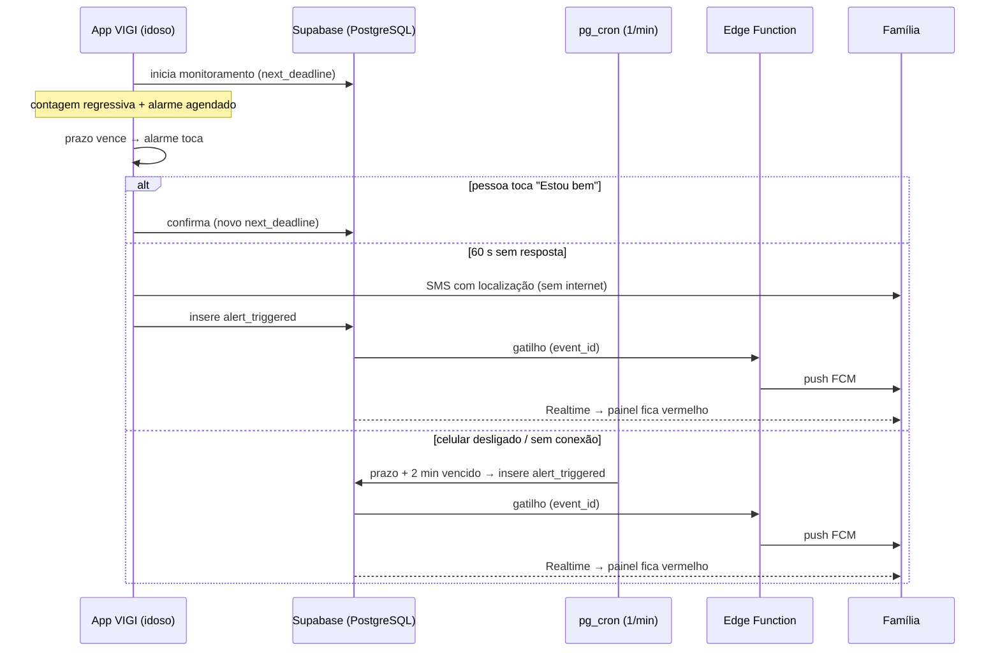
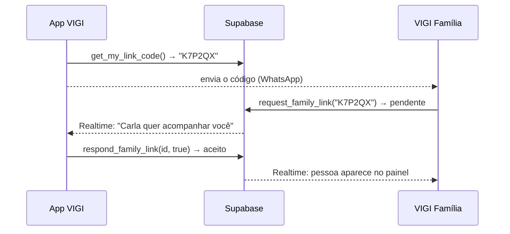

# Arquitetura do VIGI

## 1. Camadas (Clean Architecture + BLoC)

Cada funcionalidade em `lib/features/<nome>/` é dividida em três camadas, com
dependências apontando sempre para o domínio:

```
presentation/  →  domain/  ←  data/
(BLoC, páginas)   (entidades,   (datasources Supabase,
                   casos de uso,  modelos, repositórios
                   contratos)     concretos)
```

| Camada | Responsabilidade | Exemplo |
|---|---|---|
| **domain** | Regras de negócio puras, sem Flutter nem Supabase | `WellbeingStatus.evaluate`, `StartMonitoringUseCase` |
| **data** | Acesso ao Supabase e conversão de exceções em `Failure` | `CheckinRepositoryImpl`, `FamilyRemoteDataSourceImpl` |
| **presentation** | Estado da tela (BLoC/Cubit) e widgets | `CheckinBloc`, `FamilyDashboardPage` |

- Erros trafegam como `Either<Failure, T>` (pacote `fpdart`).
- Injeção de dependências com `get_it` em `lib/injection/injection_container.dart`.
- O painel web (`lib/family_web/`) reaproveita `auth` e `family` sem nenhum plugin
  de hardware — por isso compila para a web.

## 2. Serviços do núcleo (`lib/core/services/`)

| Serviço | Papel |
|---|---|
| `EmergencyDispatcher` | Envia SMS nativo aos contatos (via `MainActivity.kt` / `SmsManager`), registra o alerta e aciona o push |
| `AlarmService` | Som contínuo no canal de alarme do Android + vibração |
| `NotificationService` | Notificação persistente, alarme exato agendado (`AlarmManager`) e alerta em tela cheia |
| `PushService` | Registra o token FCM do aparelho em `device_tokens` |
| `WidgetSyncService` | Atualiza o widget da tela inicial |
| `BrowserNotifier` | Notificação do navegador no painel web (import condicional) |

## 3. Fluxos principais

### 3.1 Dead man's switch (check-in não respondido)



- O servidor só age se o app não o fez (tolerância de 2 min e verificação de
  alerta já registrado).
- A confirmação funciona **sem internet**: o ciclo local recomeça e o app reenvia
  ao servidor a cada 30 s.
- Cada alerta gera **um único push**: a Edge Function "reivindica" o evento
  (`checkin_events.notified_at`) antes de enviar.

### 3.2 Botão de pânico

1. `TriggerPanicUseCase` obtém a localização e registra `panic` em `checkin_events`.
2. `PanicBloc` envia o SMS **mesmo se o registro no servidor falhar**.
3. O gatilho do banco chama a Edge Function (push) e o Realtime atualiza o painel.

### 3.3 Vínculo familiar com consentimento



Criar e autorizar vínculos só é possível pelas funções do banco
(`SECURITY DEFINER`); o RLS permite ao cliente apenas **ler** e **remover** os
próprios vínculos. Assim, um familiar não consegue se autorizar sozinho.

### 3.4 Painel da família (não invasivo)

`FamilyDashboardCubit` assina, via Realtime, `monitoring_settings` e os últimos
20 eventos de cada pessoa autorizada. `WellbeingStatus.evaluate` (função pura,
testada) decide a situação:

| Situação | Regra |
|---|---|
| **Emergência** | Pânico ou alerta nas últimas 24 h sem check-in posterior |
| **Pausado** | Monitoramento desligado |
| **Atrasado** | Prazo vencido (alarme tocando no celular) |
| **Tudo bem** | Monitoramento ativo dentro do prazo |

A localização só aparece no cartão durante uma emergência.

## 4. Banco de dados

| Tabela | Conteúdo | Quem lê |
|---|---|---|
| `profiles` | Nome, telefone, código VIGI | O próprio usuário e as pessoas vinculadas |
| `emergency_contacts` | Quem recebe o SMS | O próprio usuário |
| `monitoring_modes` | Rotina, Banho, Sono e personalizados | Todos (sistema) / dono |
| `monitoring_settings` | Estado do dead man's switch (`next_deadline`, `last_ping`) | Dono e familiares aceitos |
| `checkin_events` | check-in, pânico, alerta, resolução (+ localização) | Dono e familiares aceitos |
| `family_links` | Vínculos (pending / accepted / rejected) | As duas partes |
| `device_tokens` | Tokens FCM | Dono |

Todas as tabelas têm **Row Level Security**. Funções relevantes:

| Função | Uso |
|---|---|
| `check_expired_heartbeats()` | Executada pelo pg_cron a cada minuto |
| `notify_on_alert()` | Gatilho que chama a Edge Function com o `event_id` |
| `get_my_link_code()`, `request_family_link()`, `respond_family_link()` | Vínculo com consentimento |
| `guardiao_health()` | Diagnóstico da infraestrutura (somente booleanos) |

## 5. Edge Function `notify-emergency-contacts`

- Entrada: `{ "event_id": "<uuid>" }` (gatilho do banco ou reforço do app) ou
  `{ "healthcheck": true }`.
- Carrega o evento com a *service role* — o chamador não consegue forjar alertas.
- Autentica no Google com a conta de serviço (`FIREBASE_SERVICE_ACCOUNT`, JSON
  puro ou base64) e envia pela **FCM HTTP v1**.
- Remove tokens inválidos e libera o evento para nova tentativa se nenhum envio
  der certo.
